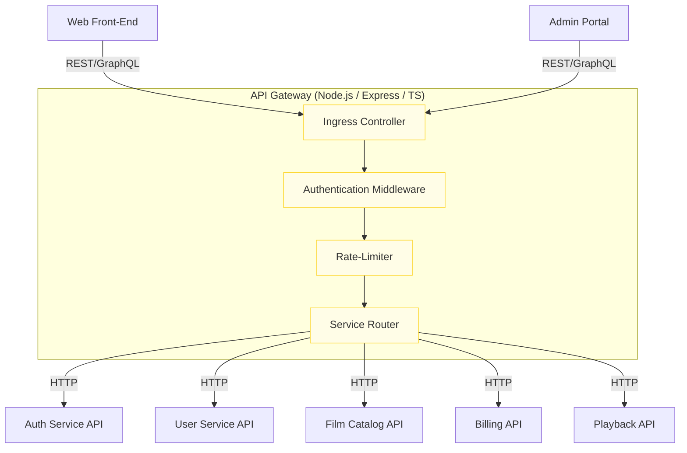
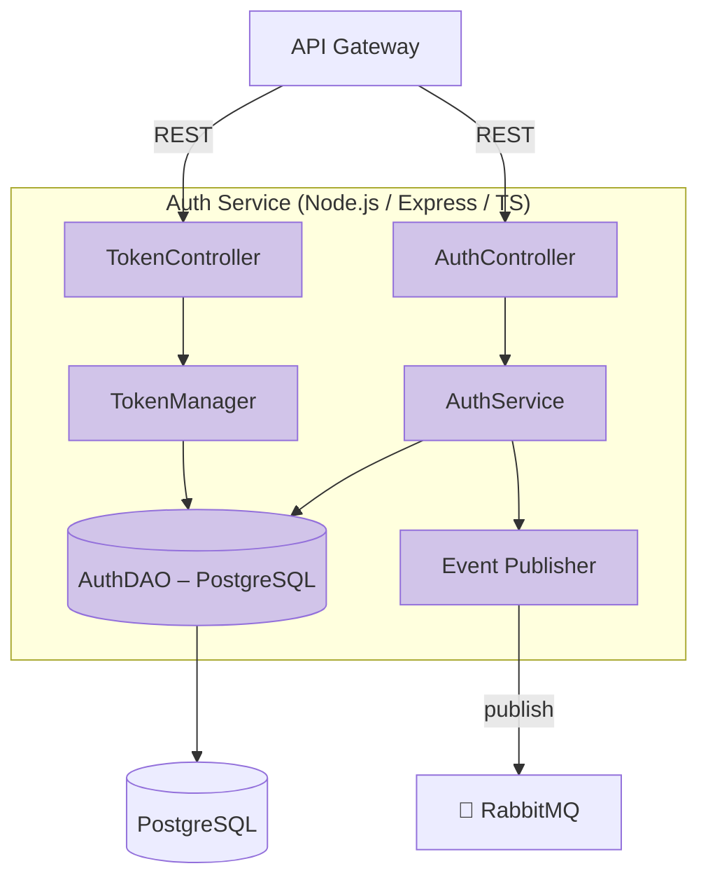
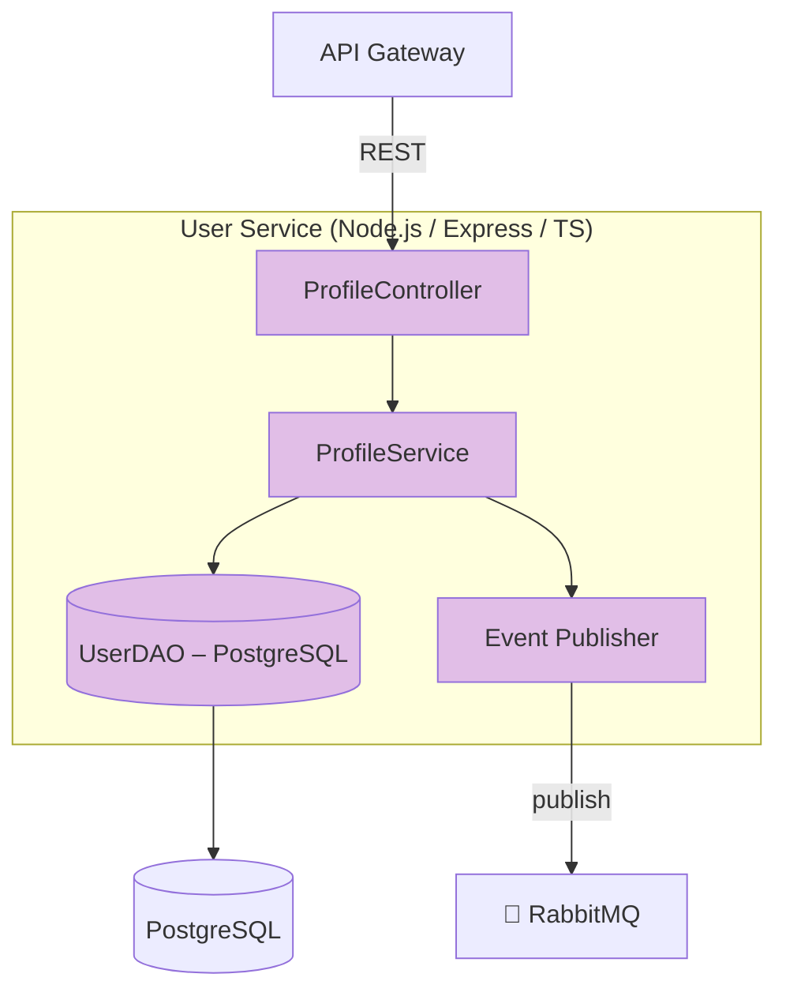
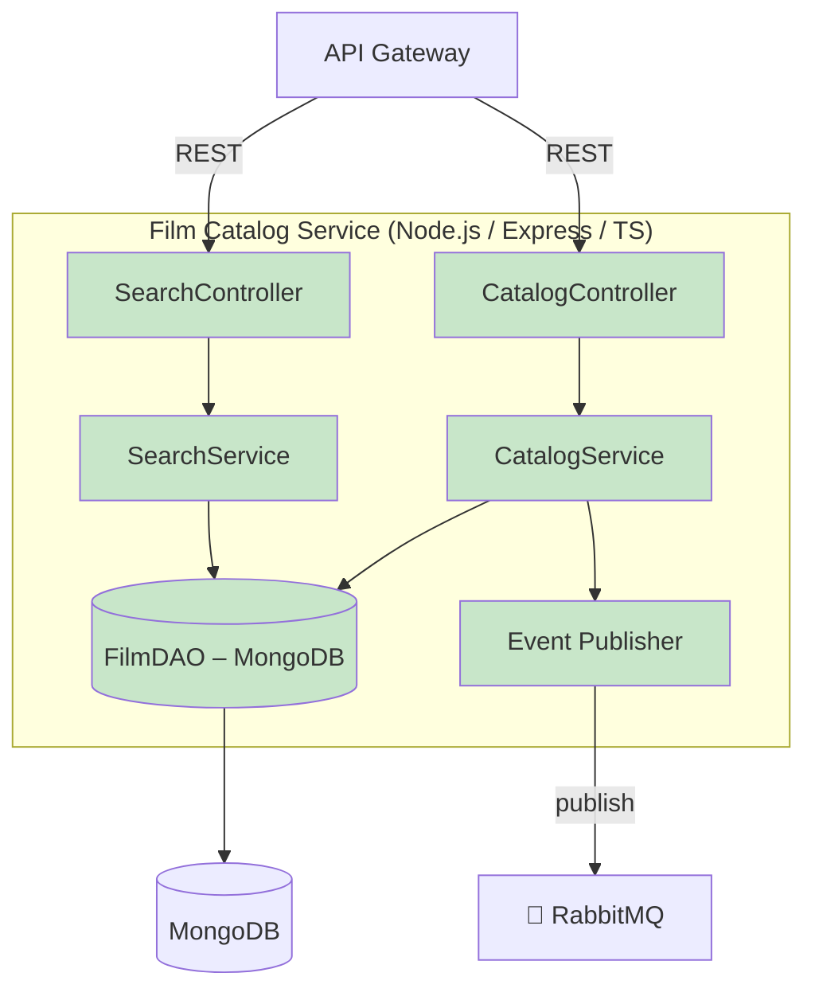
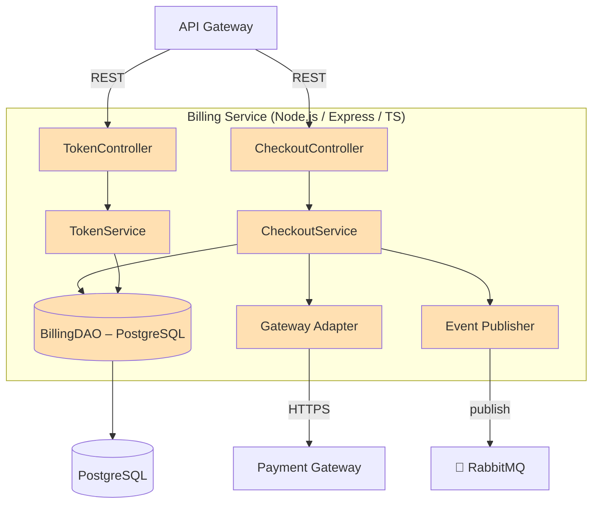
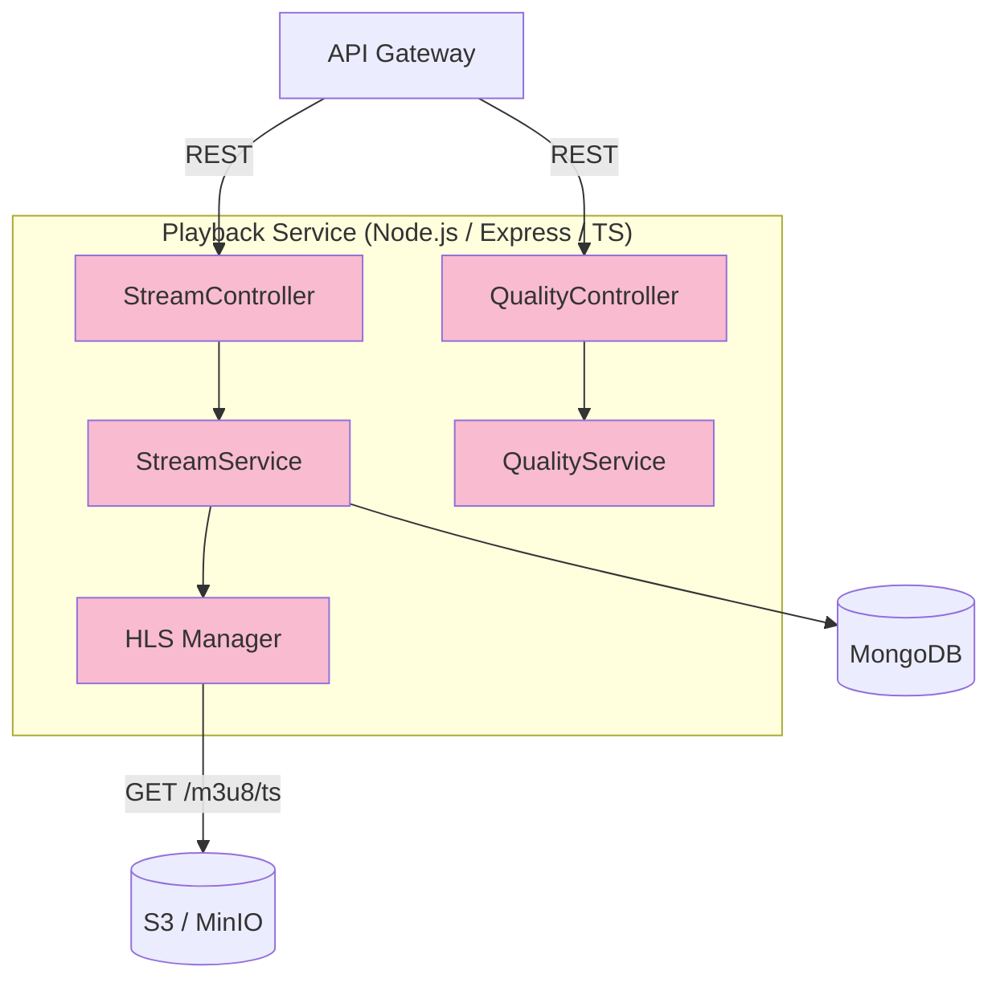
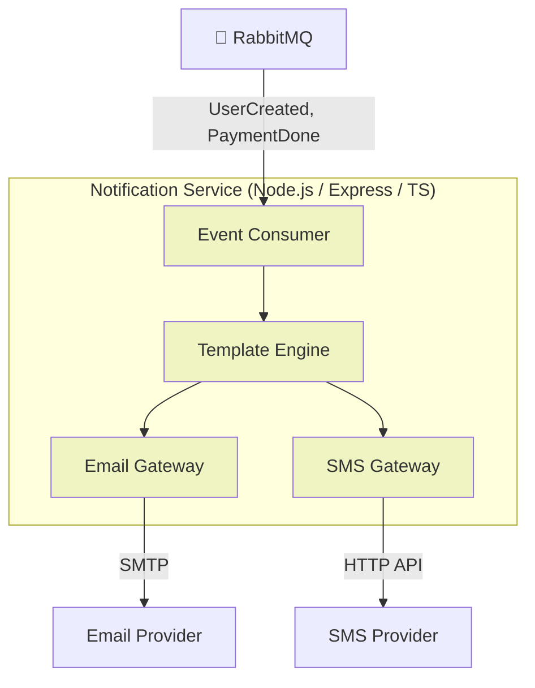
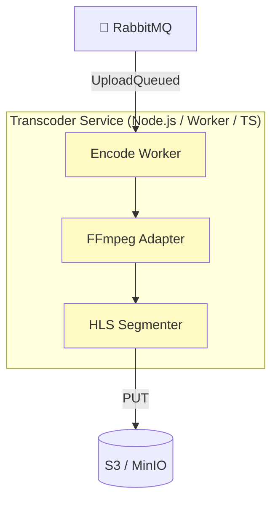

# C4-Model: Component Diagrams – Movie Streaming Platform

This document drills down into each micro-service container to illustrate its internal components and their interactions.

---

## 1. API Gateway

---

## 2. Auth Service

---

## 3. User Service

---

## 4. Film Catalog Service

---

## 5. Billing Service

---

## 6. Playback Service

---

## 7. Notification Service

---

## 8. Transcoder Service
