# C4-Model: Container Diagram – Movie Streaming Platform

This container diagram zooms into the internal structure of the Movie Streaming Platform, showing the major deployable units (containers) and how they communicate.

```mermaid
graph TB
    %% Runtime Environment
    subgraph "🏗️ Kubernetes Cluster"
        %% Front-end tier
        subgraph "Frontend"
            WebApp["🌐 Web App\nReact/Vue – Nginx"]
            AdminPortal["⚙️ Admin Portal\nReact/Vue – Nginx"]
        end

        %% Edge tier
        APIGateway["🚪 API Gateway\nNode.js + TypeScript"]

        %% Micro-services tier
        subgraph "Microservices"
            AuthSvc["🔑 Auth Service"]
            UserSvc["👤 User Service"]
            MovieSvc["🎬 Film Catalog Service"]
            PaymentSvc["💳 Billing Service"]
            StreamSvc["📹 Playback Service"]
            NotifySvc["📢 Notification Service"]
            TranscodeSvc["🔄 Transcoder Service"]
        end

        %% Messaging
        MQ["🐰 RabbitMQ"]

        %% Observability
        FluentBit["📊 Fluent Bit"]
        Loki["📚 Loki"]
        Grafana["📈 Grafana"]
    end

    %% Databases & Storage (outside K8s)
    Postgres[("🐘 PostgreSQL\nRelational Data")]
    Mongo[("🍃 MongoDB\nFilm Meta & Comments")]
    ObjectStore[("☁️ S3 / MinIO\nVideo Files (HLS)")]

    %% External integrations
    PaymentGW["💳 Payment Gateway"]
    EmailProv["📧 Email Provider"]
    SmsProv["📱 SMS Provider"]
    CDN["📦 CDN"]

    %% Request flow
    WebApp -->|HTTP| APIGateway
    AdminPortal -->|HTTP| APIGateway
    APIGateway -->|REST| AuthSvc
    APIGateway -->|REST| UserSvc
    APIGateway -->|REST| MovieSvc
    APIGateway -->|REST| PaymentSvc
    APIGateway -->|REST| StreamSvc

    %% Data connections
    AuthSvc --> Postgres
    UserSvc --> Postgres
    PaymentSvc --> Postgres
    MovieSvc --> Mongo
    StreamSvc --> Mongo
    StreamSvc --> ObjectStore
    TranscodeSvc --> ObjectStore

    %% Messaging connections
    AuthSvc -- "publish/consume" --> MQ
    UserSvc -- "publish/consume" --> MQ
    PaymentSvc -- "publish/consume" --> MQ
    MovieSvc -- "publish/consume" --> MQ
    TranscodeSvc -- "publish/consume" --> MQ
    NotifySvc -- "consume" --> MQ

    %% External services
    PaymentSvc -->|HTTPS| PaymentGW
    NotifySvc --> EmailProv
    NotifySvc --> SmsProv
    ObjectStore --> CDN

    %% Logging & Metrics
    classDef logging fill:#f9fbe7,stroke:#cddc39;
    FluentBit:::logging --> Loki:::logging --> Grafana:::logging
    class FluentBit,Loki,Grafana logging;

    %% Style groups for quick visual cues
    classDef frontend fill:#e1f5fe,stroke:#039be5;
    class WebApp,AdminPortal frontend;

    classDef edge fill:#fffde7,stroke:#fdd835;
    class APIGateway edge;

    classDef service fill:#ede7f6,stroke:#673ab7;
    class AuthSvc,UserSvc,MovieSvc,PaymentSvc,StreamSvc,NotifySvc,TranscodeSvc service;

    classDef datastore fill:#e8f5e9,stroke:#43a047;
    class Postgres,Mongo,ObjectStore datastore;
``` 

