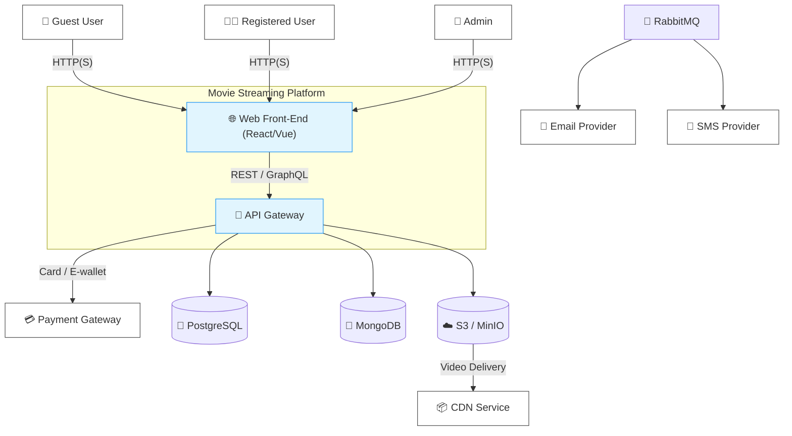

# C4-Model: Context Diagram – Movie Streaming Platform

The context diagram shows how end-users and external systems interact with the Movie Streaming Platform as a whole.

```mermaid
graph TB
    %% Internal System Boundary
    subgraph "Movie Streaming Platform"
        WebUI["🌐 Web Front-End (React/Vue)"]
        APIGW["🚪 API Gateway"]
    end

    %% Primary Actors
    Guest["👤 Guest User"]
    Member["🧑‍💻 Registered User"]
    AdminUser["👑 Admin"]

    %% External Services
    PaymentGW["💳 Payment Gateway"]
    CDN["📦 CDN Service"]
    EmailSvc["📧 Email Provider"]
    SmsSvc["📱 SMS Provider"]

    %% Persistent Stores (outside the boundary but tightly coupled)
    Postgres[("🐘 PostgreSQL")] 
    Mongo[("🍃 MongoDB")]
    ObjectStore[("☁️ S3 / MinIO")]

    %% Message Bus
    EventBus["🐰 RabbitMQ"]

    %% User Interactions
    Guest -->|"HTTP(S)"| WebUI
    Member -->|"HTTP(S)"| WebUI
    AdminUser -->|"HTTP(S)"| WebUI
    WebUI -->|"REST / GraphQL"| APIGW

    %% Platform ↔ External Systems
    APIGW -->|"Card / E-wallet"| PaymentGW
    ObjectStore -->|"Video Delivery"| CDN
    EventBus --> EmailSvc
    EventBus --> SmsSvc

    %% Internal Data Stores (from APIGW perspective)
    APIGW --> Postgres
    APIGW --> Mongo
    APIGW --> ObjectStore

    %% Styling
    classDef actor fill:#ffffff,stroke:#555,stroke-width:1px;
    class Guest,Member,AdminUser,PaymentGW,CDN,EmailSvc,SmsSvc actor;
    style WebUI fill:#e1f5fe,stroke:#2196f3
    style APIGW fill:#e1f5fe,stroke:#2196f3
``` 