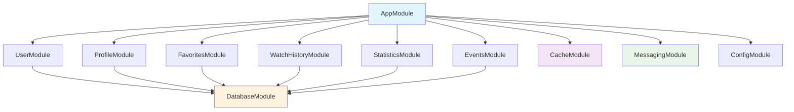

# 2. NestJS Module Structure

## 2.1 Core Modules

```
src/
├── app.module.ts                    # Root module
├── main.ts                          # Application entry point
├── common/                          # Shared utilities
│   ├── constants/
│   ├── decorators/
│   ├── filters/
│   ├── guards/
│   ├── interceptors/
│   ├── pipes/
│   └── utils/
├── config/                          # Configuration
│   ├── database.config.ts
│   ├── redis.config.ts
│   ├── rabbitmq.config.ts
│   └── app.config.ts
├── modules/                         # Business modules
│   ├── user/
│   ├── profile/
│   ├── favorites/
│   ├── watch-history/
│   ├── statistics/
│   └── events/
└── shared/                          # Shared services
    ├── database/
    ├── cache/
    └── messaging/
```

## 2.2 Module Dependencies



---
