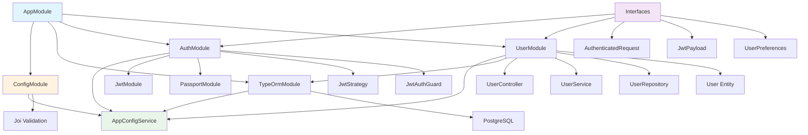

# 2. NestJS Module Structure

## 2.1 Core Project Structure

```
src/
├── app.module.ts                    # Root module with global configuration
├── main.ts                          # Application entry point with validation setup
├── interfaces/                      # TypeScript interfaces (domain-organized)
│   ├── auth.interface.ts           # JWT payload, authenticated request types
│   ├── user.interface.ts           # User preferences and related types
│   ├── index.ts                    # Re-exports all interfaces
│   └── README.md                   # Interface organization guidelines
├── config/                         # Centralized configuration management
│   ├── config.service.ts           # AppConfigService with validation
│   ├── config.module.ts            # Global configuration module
│   ├── config.validation.ts        # Joi validation schemas
│   └── index.ts                    # Configuration exports
├── modules/                        # Business domain modules
│   ├── auth/                       # Authentication & authorization
│   │   ├── auth.module.ts
│   │   ├── guards/
│   │   │   └── jwt-auth.guard.ts
│   │   └── strategies/
│   │       └── jwt.strategy.ts
│   └── user/                       # User management
│       ├── user.module.ts
│       ├── controllers/
│       │   └── user.controller.ts
│       ├── services/
│       │   └── user.service.ts
│       ├── repositories/
│       │   └── user.repository.ts
│       ├── entities/
│       │   └── user.entity.ts
│       └── dto/
│           ├── user-profile-response.dto.ts
│           └── update-profile-request.dto.ts
└── database/                       # Database setup and migrations
    ├── migrations/
    │   └── 001-create-users-table.ts
    └── seeders/
        └── user.seeder.ts
```

## 2.2 Module Dependencies



## 2.3 Configuration Architecture

The application follows a centralized configuration pattern:

- **AppConfigService**: Single source of truth for all environment variables
- **Joi Validation**: Strict validation of all configuration at startup
- **No Default Values**: All environment variables must be explicitly provided
- **Type Safety**: Full TypeScript support with proper type definitions
- **Fail-Fast**: Application won't start with invalid configuration

## 2.4 Interface Organization

Interfaces are organized by domain and separated from business logic:

- **Domain-based Structure**: `auth.interface.ts`, `user.interface.ts`
- **Centralized Exports**: All interfaces exported from `interfaces/index.ts`
- **Documentation**: Each interface file includes JSDoc comments
- **No Logic**: Pure type definitions without business logic

---
