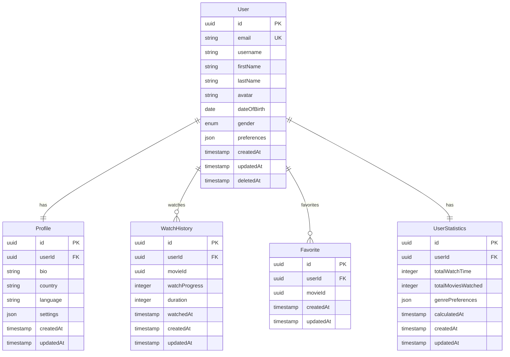

# 3. Database Architecture

## 3.1 Entity Relationship Diagram



## 3.2 Database Configuration

```typescript
// database.config.ts
export const databaseConfig = {
  type: 'postgres',
  host: process.env.DB_HOST,
  port: parseInt(process.env.DB_PORT),
  username: process.env.DB_USERNAME,
  password: process.env.DB_PASSWORD,
  database: process.env.DB_DATABASE,
  entities: ['dist/**/*.entity.js'],
  migrations: ['dist/migrations/*.js'],
  synchronize: false,
  logging: process.env.NODE_ENV === 'development',
  ssl: process.env.NODE_ENV === 'production',
  extra: {
    connectionLimit: 10,
    acquireTimeoutMillis: 60000,
    timeout: 60000
  }
};
```

---
