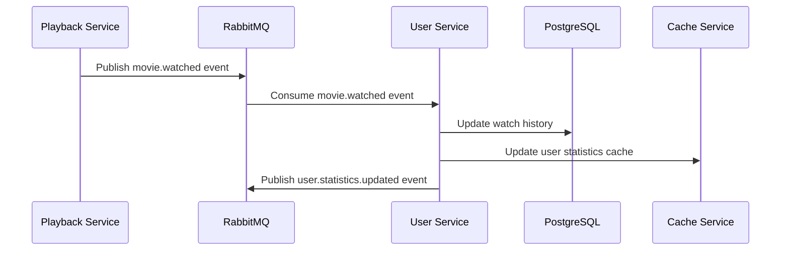

# 5. Event-Driven Architecture

## 5.1 Event Types

```typescript
// Event interfaces
interface UserCreatedEvent {
  type: 'user.created';
  payload: {
    userId: string;
    email: string;
    username: string;
    timestamp: Date;
  };
}

interface UserUpdatedEvent {
  type: 'user.updated';
  payload: {
    userId: string;
    changes: Record<string, any>;
    timestamp: Date;
  };
}

interface MovieWatchedEvent {
  type: 'movie.watched';
  payload: {
    userId: string;
    movieId: string;
    watchProgress: number;
    duration: number;
    timestamp: Date;
  };
}
```

## 5.2 Event Flow



---
