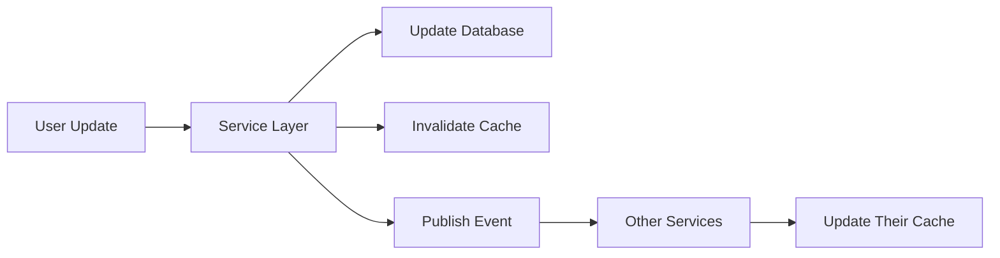

# 7. Caching Strategy

## 7.1 Cache Layers

```typescript
// Redis cache configuration
@Injectable()
export class CacheService {
  constructor(
    @Inject('REDIS_CLIENT') private redis: Redis,
  ) {}

  async getUserProfile(userId: string): Promise<UserProfile> {
    const cached = await this.redis.get(`user:${userId}`);
    if (cached) return JSON.parse(cached);
    
    // Fetch from database and cache
    const profile = await this.fetchFromDatabase(userId);
    await this.redis.setex(`user:${userId}`, 3600, JSON.stringify(profile));
    return profile;
  }
}
```

## 7.2 Cache Invalidation



---
