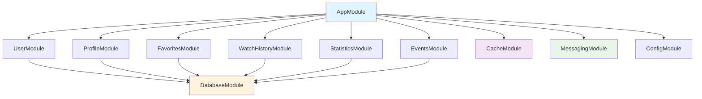
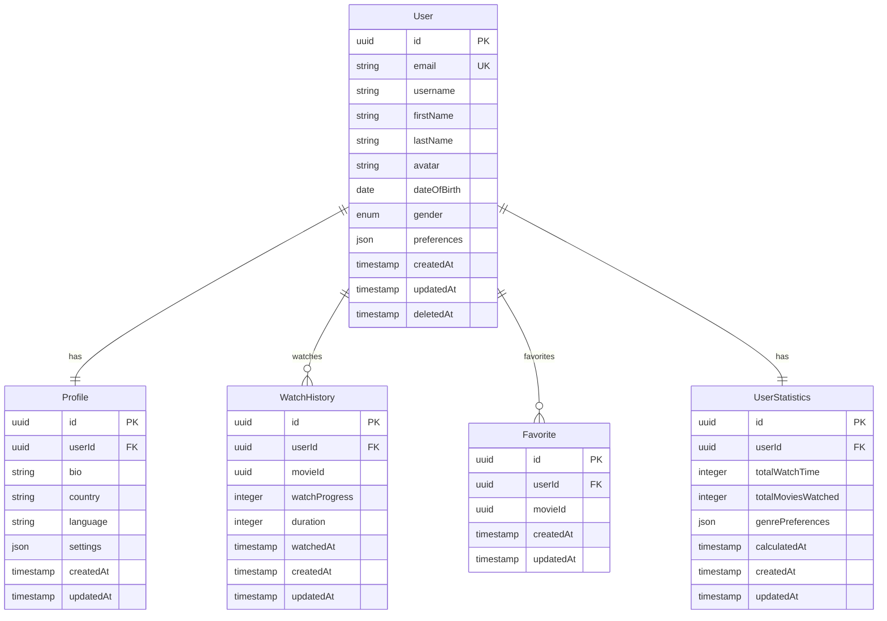
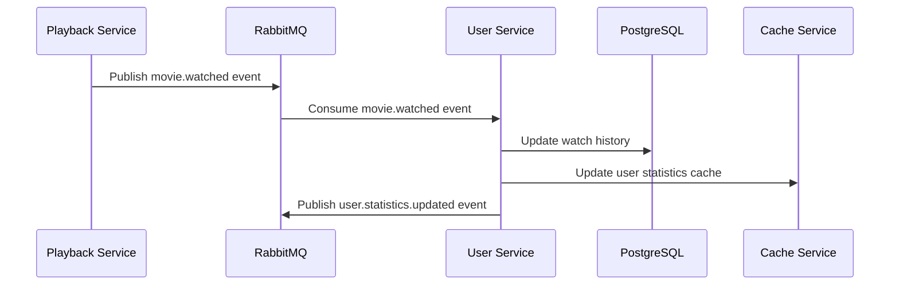
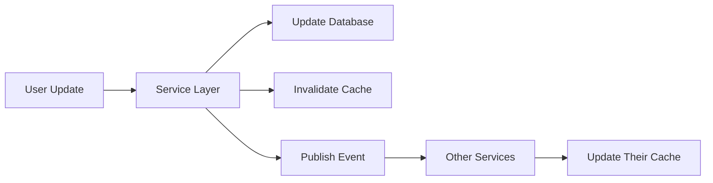
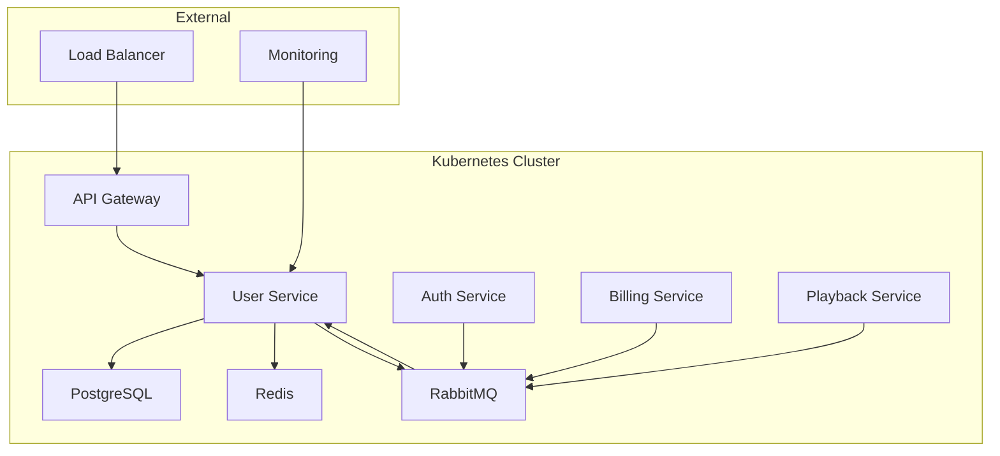

# User Service Architecture - Movie Streaming Platform

> Tài liệu này mô tả kiến trúc chi tiết của User Service trong hệ thống Movie Streaming Platform, sử dụng NestJS framework.

---

## 1. Architecture Overview

### 1.1 High-Level Architecture

```
┌─────────────────────────────────────────────────────────────────┐
│                        User Service                             │
├─────────────────────────────────────────────────────────────────┤
│  ┌─────────────────┐  ┌─────────────────┐  ┌─────────────────┐  │
│  │   Controllers   │  │   Guards/MW     │  │   Interceptors  │  │
│  │   (REST API)    │  │   (Auth/Valid)  │  │   (Logging)     │  │
│  └─────────────────┘  └─────────────────┘  └─────────────────┘  │
├─────────────────────────────────────────────────────────────────┤
│  ┌─────────────────┐  ┌─────────────────┐  ┌─────────────────┐  │
│  │   Services      │  │   DTOs/Pipes    │  │   Filters       │  │
│  │  (Business)     │  │   (Validation)  │  │   (Error)       │  │
│  └─────────────────┘  └─────────────────┘  └─────────────────┘  │
├─────────────────────────────────────────────────────────────────┤
│  ┌─────────────────┐  ┌─────────────────┐  ┌─────────────────┐  │
│  │   Repositories  │  │   Entities      │  │   Event Bus     │  │
│  │   (Data Access) │  │   (ORM Models)  │  │   (RabbitMQ)    │  │
│  └─────────────────┘  └─────────────────┘  └─────────────────┘  │
└─────────────────────────────────────────────────────────────────┘
           │                    │                    │
           ▼                    ▼                    ▼
    ┌─────────────┐    ┌─────────────┐    ┌─────────────┐
    │ PostgreSQL  │    │   Redis     │    │  RabbitMQ   │
    │  Database   │    │   Cache     │    │   Message   │
    └─────────────┘    └─────────────┘    └─────────────┘
```

### 1.2 Technology Stack
- **Framework**: NestJS (Node.js + TypeScript)
- **Database**: PostgreSQL with TypeORM
- **Cache**: Redis
- **Message Queue**: RabbitMQ
- **API**: RESTful with OpenAPI/Swagger
- **Validation**: class-validator + class-transformer
- **Testing**: Jest + Supertest
- **Monitoring**: Prometheus + Grafana

---

## 2. NestJS Module Structure

### 2.1 Core Modules

```
src/
├── app.module.ts                    # Root module
├── main.ts                          # Application entry point
├── common/                          # Shared utilities
│   ├── constants/
│   ├── decorators/
│   ├── filters/
│   ├── guards/
│   ├── interceptors/
│   ├── pipes/
│   └── utils/
├── config/                          # Configuration
│   ├── database.config.ts
│   ├── redis.config.ts
│   ├── rabbitmq.config.ts
│   └── app.config.ts
├── modules/                         # Business modules
│   ├── user/
│   ├── profile/
│   ├── favorites/
│   ├── watch-history/
│   ├── statistics/
│   └── events/
└── shared/                          # Shared services
    ├── database/
    ├── cache/
    └── messaging/
```

### 2.2 Module Dependencies



---

## 3. Database Architecture

### 3.1 Entity Relationship Diagram



### 3.2 Database Configuration

```typescript
// database.config.ts
export const databaseConfig = {
  type: 'postgres',
  host: process.env.DB_HOST,
  port: parseInt(process.env.DB_PORT),
  username: process.env.DB_USERNAME,
  password: process.env.DB_PASSWORD,
  database: process.env.DB_DATABASE,
  entities: ['dist/**/*.entity.js'],
  migrations: ['dist/migrations/*.js'],
  synchronize: false,
  logging: process.env.NODE_ENV === 'development',
  ssl: process.env.NODE_ENV === 'production',
  extra: {
    connectionLimit: 10,
    acquireTimeoutMillis: 60000,
    timeout: 60000
  }
};
```

---

## 4. API Design

### 4.1 RESTful API Structure

```
/api/v1/users
├── GET    /                        # Get users list (Admin only)
├── GET    /me                      # Get current user profile
├── PUT    /me                      # Update current user profile
├── DELETE /me                      # Delete current user
├── GET    /me/favorites            # Get user favorites
├── POST   /me/favorites            # Add movie to favorites
├── DELETE /me/favorites/:movieId   # Remove from favorites
├── GET    /me/watch-history        # Get watch history
├── POST   /me/watch-history        # Add watch history entry
├── DELETE /me/watch-history/:id    # Remove watch history entry
├── GET    /me/statistics           # Get user statistics
├── GET    /:userId                 # Get user by ID (Admin only)
└── PUT    /:userId/status          # Update user status (Admin only)
```

### 4.2 Request/Response Examples

```typescript
// User Profile Response
interface UserProfileResponse {
  id: string;
  email: string;
  username: string;
  firstName: string;
  lastName: string;
  avatar?: string;
  dateOfBirth?: Date;
  gender?: 'male' | 'female' | 'other';
  preferences: {
    language: string;
    notifications: boolean;
    autoplay: boolean;
  };
  createdAt: Date;
  updatedAt: Date;
}

// Update Profile Request
interface UpdateProfileRequest {
  firstName?: string;
  lastName?: string;
  avatar?: string;
  dateOfBirth?: Date;
  gender?: 'male' | 'female' | 'other';
  preferences?: {
    language?: string;
    notifications?: boolean;
    autoplay?: boolean;
  };
}
```

---

## 5. Event-Driven Architecture

### 5.1 Event Types

```typescript
// Event interfaces
interface UserCreatedEvent {
  type: 'user.created';
  payload: {
    userId: string;
    email: string;
    username: string;
    timestamp: Date;
  };
}

interface UserUpdatedEvent {
  type: 'user.updated';
  payload: {
    userId: string;
    changes: Record<string, any>;
    timestamp: Date;
  };
}

interface MovieWatchedEvent {
  type: 'movie.watched';
  payload: {
    userId: string;
    movieId: string;
    watchProgress: number;
    duration: number;
    timestamp: Date;
  };
}
```

### 5.2 Event Flow



---

## 6. Security Architecture

### 6.1 Authentication & Authorization

```typescript
// JWT Guard
@Injectable()
export class JwtAuthGuard extends AuthGuard('jwt') {
  canActivate(context: ExecutionContext): boolean {
    // JWT validation logic
    return super.canActivate(context);
  }
}

// Role-based access control
@Injectable()
export class RolesGuard implements CanActivate {
  constructor(private reflector: Reflector) {}
  
  canActivate(context: ExecutionContext): boolean {
    const requiredRoles = this.reflector.get<string[]>('roles', context.getHandler());
    if (!requiredRoles) return true;
    
    const { user } = context.switchToHttp().getRequest();
    return requiredRoles.some(role => user.roles?.includes(role));
  }
}
```

### 6.2 Data Protection

```typescript
// Sensitive data encryption
@Entity('users')
export class User {
  @PrimaryGeneratedColumn('uuid')
  id: string;

  @Column({ unique: true })
  email: string;

  @Column({ transformer: encryptionTransformer })
  personalInfo: string; // Encrypted field

  @Exclude({ toPlainOnly: true })
  password: string; // Excluded from responses
}
```

---

## 7. Caching Strategy

### 7.1 Cache Layers

```typescript
// Redis cache configuration
@Injectable()
export class CacheService {
  constructor(
    @Inject('REDIS_CLIENT') private redis: Redis,
  ) {}

  async getUserProfile(userId: string): Promise<UserProfile> {
    const cached = await this.redis.get(`user:${userId}`);
    if (cached) return JSON.parse(cached);
    
    // Fetch from database and cache
    const profile = await this.fetchFromDatabase(userId);
    await this.redis.setex(`user:${userId}`, 3600, JSON.stringify(profile));
    return profile;
  }
}
```

### 7.2 Cache Invalidation



---

## 8. Error Handling

### 8.1 Global Exception Filter

```typescript
@Catch()
export class GlobalExceptionFilter implements ExceptionFilter {
  catch(exception: unknown, host: ArgumentsHost) {
    const ctx = host.switchToHttp();
    const response = ctx.getResponse();
    const request = ctx.getRequest();

    const status = exception instanceof HttpException 
      ? exception.getStatus() 
      : HttpStatus.INTERNAL_SERVER_ERROR;

    const errorResponse = {
      statusCode: status,
      timestamp: new Date().toISOString(),
      path: request.url,
      message: exception.message || 'Internal server error',
    };

    response.status(status).json(errorResponse);
  }
}
```

---

## 9. Testing Strategy

### 9.1 Test Structure

```
src/
├── modules/
│   └── user/
│       ├── user.controller.spec.ts     # Unit tests
│       ├── user.service.spec.ts        # Unit tests
│       ├── user.integration.spec.ts    # Integration tests
│       └── user.e2e.spec.ts           # End-to-end tests
└── test/
    ├── fixtures/
    ├── mocks/
    └── utils/
```

### 9.2 Testing Configuration

```typescript
// Test module setup
const moduleFixture: TestingModule = await Test.createTestingModule({
  imports: [
    TypeOrmModule.forRoot({
      type: 'postgres',
      host: 'localhost',
      port: 5433,
      database: 'test_db',
      synchronize: true,
      entities: [User, Profile, WatchHistory, Favorite],
    }),
  ],
  controllers: [UserController],
  providers: [UserService, UserRepository],
}).compile();
```

---

## 10. Monitoring & Observability

### 10.1 Metrics Collection

```typescript
// Custom metrics
@Injectable()
export class MetricsService {
  private readonly userRegistrations = new Counter({
    name: 'user_registrations_total',
    help: 'Total number of user registrations',
  });

  private readonly apiRequests = new Histogram({
    name: 'api_request_duration_seconds',
    help: 'Duration of API requests',
    labelNames: ['method', 'route', 'status_code'],
  });

  recordUserRegistration() {
    this.userRegistrations.inc();
  }

  recordApiRequest(method: string, route: string, statusCode: number, duration: number) {
    this.apiRequests.observe({ method, route, status_code: statusCode }, duration);
  }
}
```

### 10.2 Health Checks

```typescript
@Controller('health')
export class HealthController {
  constructor(
    private health: HealthCheckService,
    private db: TypeOrmHealthIndicator,
    private redis: RedisHealthIndicator,
  ) {}

  @Get()
  @HealthCheck()
  check() {
    return this.health.check([
      () => this.db.pingCheck('database'),
      () => this.redis.pingCheck('redis'),
    ]);
  }
}
```

---

## 11. Deployment Architecture

### 11.1 Kubernetes Deployment

```yaml
# deployment.yaml
apiVersion: apps/v1
kind: Deployment
metadata:
  name: user-service
spec:
  replicas: 3
  selector:
    matchLabels:
      app: user-service
  template:
    metadata:
      labels:
        app: user-service
    spec:
      containers:
      - name: user-service
        image: user-service:latest
        ports:
        - containerPort: 3000
        env:
        - name: DB_HOST
          valueFrom:
            secretKeyRef:
              name: db-secret
              key: host
        resources:
          requests:
            memory: "128Mi"
            cpu: "100m"
          limits:
            memory: "512Mi"
            cpu: "500m"
        livenessProbe:
          httpGet:
            path: /health
            port: 3000
          initialDelaySeconds: 30
          periodSeconds: 10
        readinessProbe:
          httpGet:
            path: /health
            port: 3000
          initialDelaySeconds: 5
          periodSeconds: 5
```

### 11.2 Service Communication



---

## 12. Performance Considerations

### 12.1 Database Optimization

```sql
-- Indexes for better performance
CREATE INDEX idx_users_email ON users(email);
CREATE INDEX idx_watch_history_user_id ON watch_history(user_id);
CREATE INDEX idx_watch_history_watched_at ON watch_history(watched_at);
CREATE INDEX idx_favorites_user_id ON favorites(user_id);
CREATE INDEX idx_favorites_movie_id ON favorites(movie_id);
```

### 12.2 Connection Pooling

```typescript
// Database connection pool
const dataSource = new DataSource({
  type: 'postgres',
  host: process.env.DB_HOST,
  port: parseInt(process.env.DB_PORT),
  username: process.env.DB_USERNAME,
  password: process.env.DB_PASSWORD,
  database: process.env.DB_DATABASE,
  extra: {
    max: 20,          // Maximum connections
    min: 5,           // Minimum connections
    idle: 10000,      // Close connections after 10 seconds
    acquire: 30000,   // Acquire timeout
    evict: 1000,      // Evict connection every 1 second
  },
});
```

---

## 13. Future Enhancements

### 13.1 Planned Features
- GraphQL API support
- Real-time notifications via WebSocket
- Advanced user analytics
- Machine learning for personalization
- Multi-tenancy support

### 13.2 Scalability Improvements
- Database sharding strategy
- Read replicas for queries
- Event sourcing implementation
- CQRS pattern adoption
- Horizontal pod autoscaling

---

> Tài liệu này sẽ được cập nhật thường xuyên theo sự phát triển của hệ thống. 